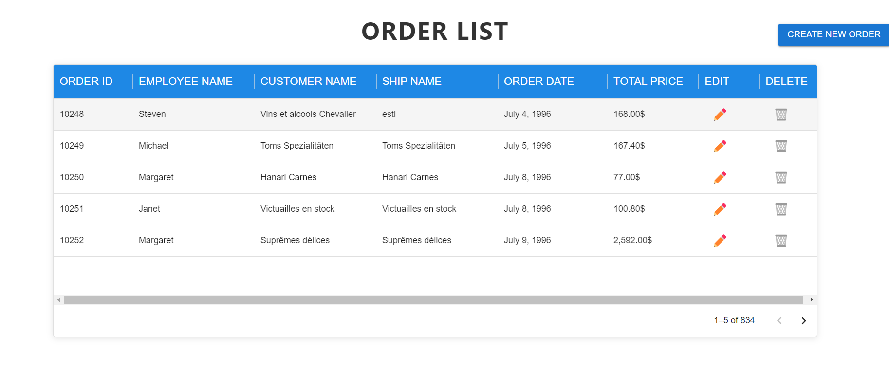

# Order Management System

  


## Project Overview
The Order Management System is a full-stack web application designed to facilitate efficient order management. It allows users to view, create, edit, and delete orders, providing a seamless experience for managing order-related data. The system is built with a modern tech stack that ensures scalability, maintainability, and responsiveness.

## Frontend Technologies
    1. React: A JavaScript library for building user interfaces, allowing for the creation of reusable UI components and efficient rendering of dynamic data.
    2. Material-UI: A popular React UI framework that provides pre-built components and a design system to create a visually appealing and responsive user interface.

    3. React Router: A library for routing in React applications, enabling smooth navigation between different pages without refreshing the entire application.
## Backend Technologies
    1. .NET Core 6: A cross-platform framework for building modern web applications and APIs. It provides robust performance and scalability for handling API requests.
    2. Entity Framework: An object-relational mapper (ORM) that simplifies data access in .NET applications by allowing developers to work with data using .NET objects.
    3.  SQL Server: A relational database management system (RDBMS) used to store and manage order data efficiently. The database is accessed through stored procedures for optimal performance and security.
## Development and Deployment Technologies

1. Docker: A platform that enables developers to automate the deployment of applications inside lightweight containers, ensuring consistent environments across development and production.

2. SQL Server Management Studio (SSMS): A powerful tool for managing SQL Server instances, allowing developers to query, design, and manage databases with ease.
Project Workflow

3. Development Environment Setup: The project is set up using Docker for SQL Server to ensure a consistent database environment. Developers can easily pull the Docker image and run a local SQL Server instance.

## Frontend and Backend Development:
 The frontend is developed using React, leveraging Material-UI for styling. The backend is built with .NET Core, using Entity Framework for data access and SQL Server for persistent storage.
 API Integration: The frontend communicates with the backend API to fetch and manipulate order data. This architecture separates concerns, allowing for a modular approach to development.
## Responsive Design:
 Material-UI ensures the application is responsive, providing a good user experience across different devices and screen sizes.
Conclusion
This project not only showcases the capabilities of the chosen technologies but also demonstrates best practices in full-stack development. It serves as a solid foundation for building scalable order management solutions and can be further extended with additional features such as user authentication, advanced filtering, and reporting.

## Project Setup Instructions

### Prerequisites
- Node.js (v14 or later)
- npm (v6 or later)
- A running backend server on port `5131` that handles API requests.

### Installation
1. Clone the repository:
   ```bash
   git clone <https://github.com/estherwa/Northwind-Orders->
   cd order-management-system
   ```

2. Install the dependencies:
   ```bash
   npm install
   ```

### Running the Project
1. Start the application:
   ```bash
        npm run start to run the frontend application  - go to folder Frontend northwind orders press open integarted terminal and npm run start

        dotnet run to run the backend application  - go to folder Backend NorthwindAPI  press open integarted terminal and dotnet run
   ```

2. Open your browser and navigate to `http://localhost:3000`.

## Assumptions, Notes, and Design Decisions
- The backend API is assumed to be running and accessible at `http://localhost:5131`.
- The application utilizes React Router for navigation between different pages.
- Material-UI is used for styling and components to ensure a responsive and modern design.

## Feature Completion
- [x] Order List Page -- done
- [x] Create New Order Page --done
- [x] Edit Order Page  --done
- [x] View Order Details Page --done
- [x] Delete Order functionality --done


## Necessary Scripts
- Ensure the following scripts are included in your `package.json`:
  ```json
  "scripts": {
    "start": "react-scripts start",
    "build": "react-scripts build",
    "test": "react-scripts test",
    "eject": "react-scripts eject"
  }
  ```

### Port Information
- The frontend runs on port `3000`.
- The backend API runs on port `5131`.
 - SQL Server runs on port 1433 (default).

